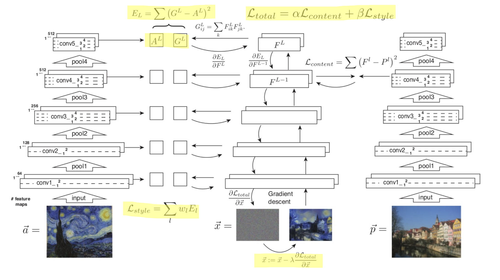
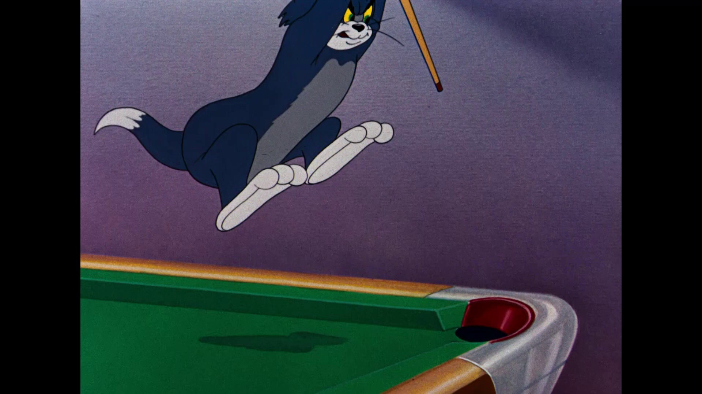
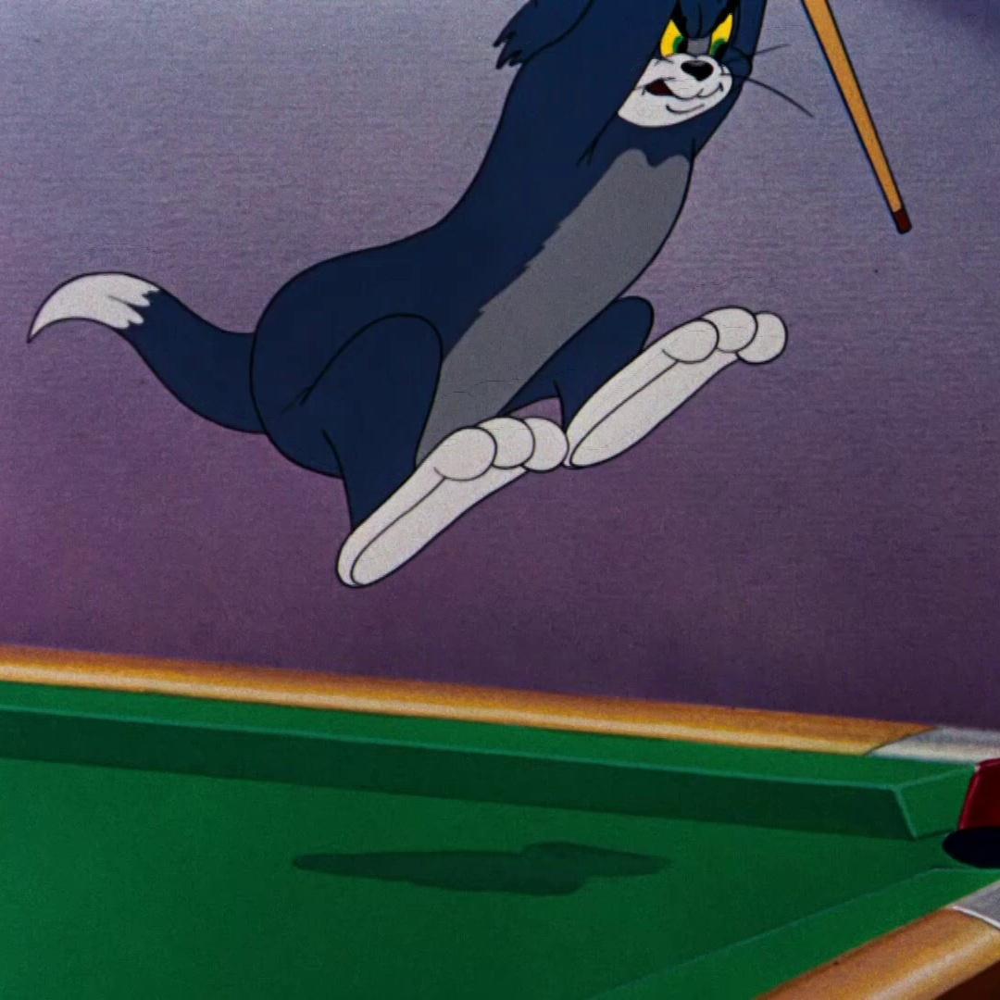
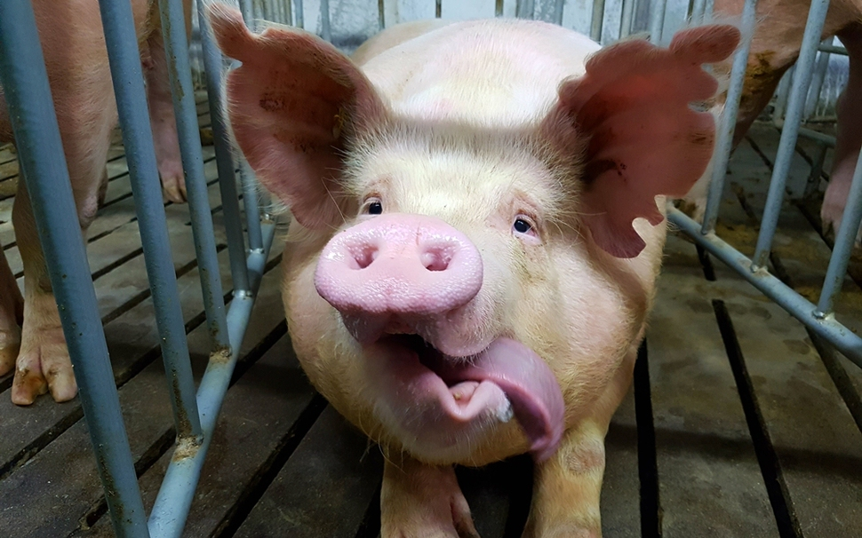
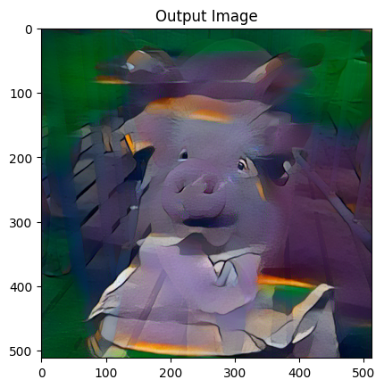
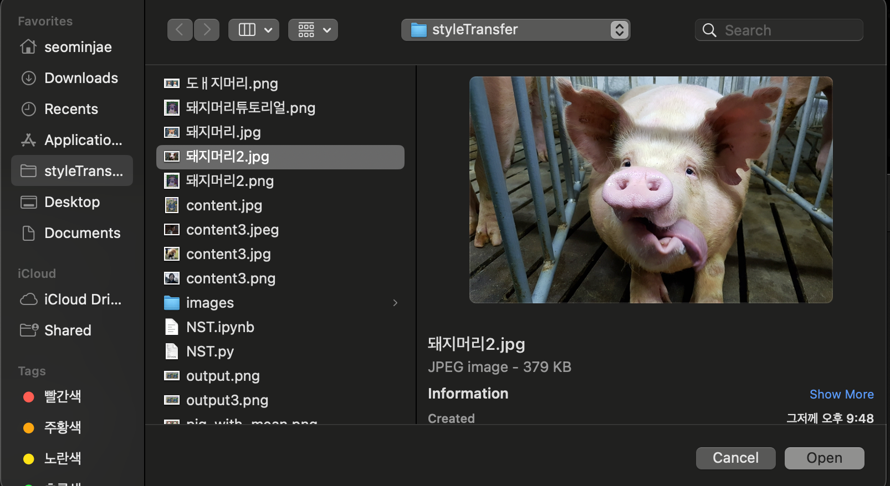
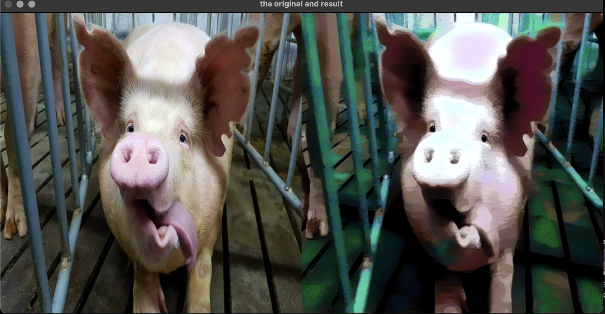
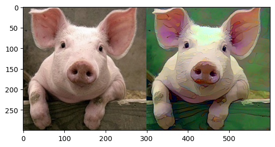

<h1>Painting-Diary</h1>

	<h3>임의의 사진을 입력받아 특정 그림체의 그림으로 바꿔주는 프로젝트입니다.</h3>
<pre>목차 
1. 프로젝트 개요
2. 참고한 논문 및  github code, dataset
3. 프로젝트 변경사항
4. 기존 모델과의 결과 비교 및 실행화면 
</pre>
<h3>프로젝트 개요</h3>
<pre>
입력이미지를 받으면 모델에서 사용하는 <strong>미국 애니메이션 그림체</strong>로 이미지의 style을 바꿔주는 프로젝트입니다.
기존의 모델은 임의의 style image를 받아 style transfer를 적용하였는데, 기존 모델에 나타나는 단점을 개선하고,
한가지 style 을 적용하게끔하며, style에 더 집중하는 모델을 만들었습니다.
해당 프로젝트 모델에서 사용하는 그림체는 미국 애니메이션 그림체입니다.
참고한 모델과 깃헙 코드가 있지만 해당 프로젝트의 목적과는 많은 차이가 있어 많은부분을 수정하였습니다.
</pre>
<h3>참고 논문(style transfer 기본 컨셉트) 및 github code</h3>
<pre>
참고 논문 : https://www.cv-foundation.org/openaccess/content_cvpr_2016/papers/Gatys_Image_Style_Transfer_CVPR_2016_paper.pdf
참고 깃헙 : https://github.com/fawazsammani/The-Complete-Neural-Networks-Bootcamp-Theory-Applications/blob/master/Neural%20Style%20Transfer.ipynb
데이터셋은 kaggle로부터 톰과제리 영상을 frame별로 펼쳐놓은 이미지들을 사용하였습니다.
</pre>

먼저 Neural style transfer의 기본적인 컨셉은 그리고 싶은 객체인 content image와 적용하고싶은 그림체를 담은 style image 두개를 input으로 넣고, 
각 이미지를 pretrained VGG 에 넣은 feature 값과 결과가 될 이미지를 VGG에 넣은 값 사이의 mse를 각각의 loss로 사용합니다.
이러한 style 이미지에 대한 style loss와 content이미지에 대한 content loss를 weighted sum을 한 것을 loss로 사용해 결과이미지의  픽셀값을 optimization합니다.  
결과이미지는 content image를 clone한 것으로부터 시작해서 loss를 줄여나가는 방향으로 optimizaion을 진행합니다.  

<pre>
<h3> <strong>변경한점</strong> </h3>
1. 조금 더 만화같은 결과를 내기 위하여 KMeans를 이용해 color분포를 단순화하는 preprocessing을
   진행했습니다.

2. 모델이 style image로 사용하는 dataset 양 옆에 있는 검은 block을 style로 착각하지 않게끔
   하기위하여 crop해주었습니다.  

      
<strong>3. 기존의 코드를 그대로 사용하면 style의 content또한 결과에 들어가므로 style만  
   가져오고자하는 목적에 어긋나므로 같은 그림체의 여러 style image 에서
   style feature들을 추출하고, 평균을 내주어 style image instance에 나타나는  
   bias들을 제거해주어 그림체 변환을 더욱 자연스럽게 만들었습니다. </strong>

4. 원래 모델은 강한 그림체를(ex 반고흐) 적용하는 것에는 괜찮았으나 미국애니메이션과같은 단순한  
   그림체를 적용하는 것에 성능이 좋지 않아 실험을 통해 최대한 그럴듯한 결과를 내놓게끔  
   hyperparameter들을 수정하였고, 위의 style instance bias를 줄이는 등의 수정이 있었습니다.

5. style feature를 추출할 때에 VGG의 앞쪽 레이어일수록 특이한 무늬를 생성하는 것을 확인하여  
   특이한 무늬들에 대한 영향을 줄이고, 뒷 레이어에 더 가중치를 두기 위해 아래의 exponential  
   계수를 추가해주었습니다. style_loss의 magnitude가 높아져 style_weight를 더 줄여주었습니다.  
   아래와 같이 수정했습니다.

   for i in VGG_layer:
       style_loss += <strong>np.exp(i**4)</strong>(VGG_i(x)
	                   -VGG_i(style))

6. 추가로, 원하는 content 이미지 입력을 편하게 위해서 file browser 를 호출합니다. 

</pre>
<h3>결과비교와 실행화면</h3>

아래는 사용하는 content image 입니다.    

  
<h4> - 기존 모델 적용결과 </h4>

이 이미지를 pytorch.org에 있는 NST tutorial 을 오른쪽 style input과 함께 그대로 사용한다면 아래와 같이 나옵니다.  

이 결과는 style의 content까지 입력된 결과로써, 제 프로젝트의 목적과는 맞지 않는 결과물이며 hyperparameter의 style weight를 낮추어도 style의 content가 들어갑니다.  
<h4> - 프로젝트의 실행화면 및 결과</h4>
먼저 프로그램을 실행하면 os 의 파일 브라우저가 실행되며 그림체를 바꾸고자하는 이미지를 선택합니다.  

   

여기서 style은 이미 모델이 style feature들을 가지고 있기 때문에 추가로 입력하지않습니다.
 

기존 모델의 문제를 개선하기 위해서 style mean 과 kmeans preprocessing 을 적용한 제 모델의 결과를 확인하면,  

위와같이 나오게됩니다.  
여전히 갈색배경을 초록색으로 바꾸는 등의 문제는 있지만 기존의 모델을 사용하는 것보다 제 취지에 맞는 결과물이 출력되고 있습니다. 
또한 입력 이미지에 따라서 hyperparameter를 다르게 설정해야하는데요,  

모델 특성상 한 입력에 따라 매번 optimize를 해야하므로 사용자에게 key 입력을 받아 바로바로 hyperparameter를 변경하면서 interation을 하고싶었지만,
계산량이 많아 즉각적인 변화를 확인할 수 없기때문에 고정된 hyperparameter를 사용합니다.

아래는 여러 hyperparameter 세팅으로 실행을 해보면서 한 입력에 대한 가장 좋은 시각적인 결과를 내어 보았습니다.  

 
  